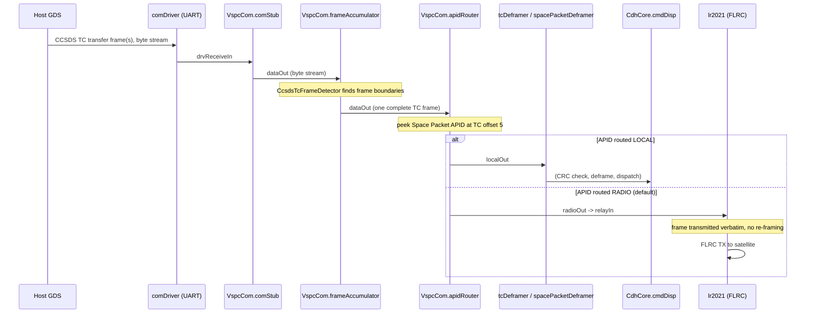
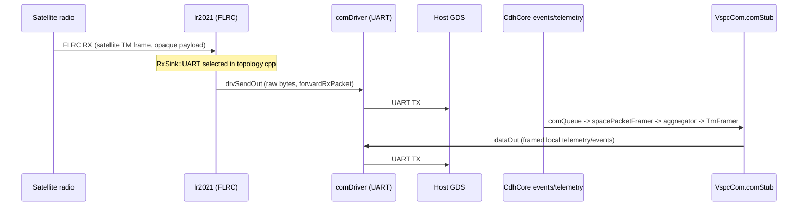

# Ground Segment Channel Coding Chain

This document describes the channel coding / framing chain on the **ground node**
(`GroundDeployment`), from the host GDS serial link down to the RF link with the
satellite. It complements [`LR2021Manager`'s SDD](../../../fprime-lr2021/Components/LR2021Manager/docs/sdd.md),
which documents the FSK/GMSK CCSDS coding chain used by the *satellite* radio link;
the ground board's own radio operates in **FLRC** mode instead (see below), and adds
a CCSDS deframe + APID-routing stage that FlatSat does not have.

## Why the ground node is different

`GroundDeployment` is not a CCSDS ground station in the traditional sense (that role
is the host GDS running `fprime-gds` on a PC). The Nucleo board is a **transparent
RF-to-UART relay / modem**, plus a small local F´ instance for its own housekeeping
(events, telemetry, watchdog feed):

- Frames arriving over UART from the host GDS are deframed just far enough to read
  the destination (CCSDS APID), then either transmitted to the satellite **verbatim**
  (no re-framing, no sequence-count regeneration) or delivered to the ground board's
  own command dispatcher.
- Frames received from the satellite over the radio are pushed **raw** out the UART
  to the host GDS, which does its own CCSDS TM deframing (the ground board does not
  decode the satellite's TM channel itself).

## Component context

```mermaid
flowchart LR
    subgraph HOST["Host GDS (PC)"]
        gds[fprime-gds]
    end

    subgraph GB["GroundDeployment (Nucleo H753ZI)"]
        comDriver[Zephyr.ZephyrUartDriver]
        comStub[Svc.ComStub]
        frameAcc["Svc.FrameAccumulator<br/>CcsdsTcFrameDetector"]
        apidRouter["Vspc.ApidRouter"]
        tcDeframer[Svc.Ccsds.TcDeframer]
        spDeframer[Svc.Ccsds.SpacePacketDeframer]
        router[Svc.FprimeRouter]
        cmdDisp[Svc.CmdDispatcher]

        comQueue[Svc.ComQueue]
        spFramer[Svc.Ccsds.SpacePacketFramer]
        aggregator[Svc.ComAggregator]
        tmFramer[Svc.Ccsds.TmFramer]

        lr2021["LR2021.LR2021Manager<br/>(FLRC mode)"]
    end

    subgraph SAT["Satellite (FlatSat)"]
        chip2[(LR2021 radio)]
    end

    gds -- "UART TX (uplink frame)" --> comDriver
    comDriver -- "$recv" --> comStub
    comStub -- dataOut --> frameAcc
    frameAcc -- "dataOut (complete TC frame)" --> apidRouter
    apidRouter -- "localOut (this board's APID)" --> tcDeframer --> spDeframer --> router --> cmdDisp
    apidRouter -- "radioOut (satellite APID)" --> lr2021
    lr2021 -- "FLRC TX" --> chip2

    chip2 -- "FLRC RX" --> lr2021
    lr2021 -- "drvSendOut (raw)" --> comDriver
    comDriver -- "UART RX (downlink frame)" --> gds

    CdhCore["CdhCore events / telemetry"] --> comQueue --> spFramer --> aggregator --> tmFramer --> comStub
    comStub -- "dataOut (downlink)" --> comDriver
```



## Physical / link layer: FLRC, not FSK

Unlike the satellite's UHF link (FSK/GMSK, CCSDS 401.0-B), the ground board's radio
runs **FLRC** (Semtech Fast Long Range Communication, 2.4 GHz S-band), configured in
[`GroundDeploymentTopology.cpp`](../../../../FprimeZephyrReference/GroundDeployment/Top/GroundDeploymentTopology.cpp):

```cpp
lr2021.setModuleType(0, LR2021::LR2021Manager::ModuleType::RY42F);
lr2021.setRxSink(LR2021::LR2021Manager::RxSink::UART);
lr2021.radioInit(0);
lr2021.setMode(0, LR2021::LR2021Manager::RadioMode::FLRC, 2065000000, -5);
```

| Parameter | Value | Notes |
|---|---|---|
| Frequency | 2065 MHz | S-band, HF RX path / PA |
| TX power | -5 dBm | Bench default |
| Bit rate / bandwidth | 0.65 Mbps / 0.74 MHz (`FLRC_BR_0_650_BW_0_740`) | `LR2021Cfg.hpp`; higher rate (2.6 Mbps) available but unused |
| Coding rate | 3/4 (`FLRC_CR_3_4`) | Semtech's built-in FEC for the FLRC engine (not CCSDS RS/BCH) |
| Pulse shape | BT = 0.5 Gaussian | `FLRC_PULSE_SHAPE` |
| Preamble | 32 bits | `FLRC_PREAMBLE_BITS` |
| Syncword | 4 B, `90 56 34 12` | `FLRC_SYNCWORD`, fixed value (bench link, not a real CCSDS syncword) |
| Packet format | Variable length (`FLRC_PKT_VAR_LEN`) | 6–511 B payload (`FLRC_MIN_PAYLOAD` / `FLRC_MAX_PAYLOAD`) |
| CRC | Off (`FLRC_CRC_OFF`) | Frame integrity relies on the CCSDS TC/TM trailer CRC-16 carried *inside* the relayed payload, not the FLRC packet CRC |

No CCSDS channel coding (RS, BCH/CLTU, randomization) is applied at this layer — FLRC
carries the CCSDS TC/TM frame **as an opaque payload**. The 0.65 Mbps FLRC link is
far faster than the UART to the host GDS (see below), so it is never the throughput
bottleneck.

## Uplink chain (host GDS → satellite / local board)



1. **`comDriver` (UART)** receives raw bytes from the host GDS and forwards them
   asynchronously to `VspcCom.comStub.drvReceiveIn`.
2. **`comStub`** passes the byte stream through unchanged to
   `VspcCom.frameAccumulator.dataIn`.
3. **`frameAccumulator`**, configured with `Svc::FrameDetectors::CcsdsTcFrameDetector`,
   finds CCSDS TC transfer frame boundaries in the stream (5 B primary header +
   variable data field + 2 B FECF) and emits one complete frame at a time.
4. **`apidRouter`** (`Vspc.ApidRouter`) peeks the Space Packet primary header
   immediately following the TC header (frame offset 5, low 11 bits = APID) and
   routes the **whole, unmodified frame**:
   - **`radioOut` → `lr2021.relayIn`** (default): the frame is handed to the FLRC
     radio as-is and transmitted to the satellite. This is a fire-and-forget path —
     no CCSDS re-framing, no sequence-count regeneration, no comStatus flow control.
     The buffer is freed right after the (synchronous) FIFO write.
   - **`localOut` → `tcDeframer` → `spacePacketDeframer` → `fprimeRouter` →
     `CdhCore.cmdDisp`**: frames whose APID is configured as this board's own are
     fully deframed and dispatched locally (ground-board housekeeping commands).
   - Frames too short to contain a Space Packet header are dropped (`ShortFrame`
     event, `DropCount` telemetry) and returned to the accumulator.
5. Routes are configured from the topology cpp
   (`VspcCom::apidRouter.setDefaultDestination(...)` /
   `setApidRoute(apid, dest)`); see [`ApidRouter`'s header](../../ApidRouter/ApidRouter.hpp)
   for the API.

### Why frame-level APID routing (not opcode-level `CmdSplitter`)

`Svc::CmdSplitter` routes *after* full command deframing, by opcode — it cannot see
file uplink packets (`Fw::ComPacketType::FW_PACKET_FILE`), only commands. The ground
relay needs to forward **both** commands and file packets to the satellite without
terminating the CCSDS session, so routing is done one layer up, on the complete TC
frame, before any deframing / sequence-count bookkeeping happens.

## Downlink chain (satellite / local board → host GDS)



Two independent downlink sources share the same UART:

1. **Satellite radio RX (relay)** — `lr2021` is configured with
   `RxSink::UART` (`LR2021Manager::setRxSink`), so every FLRC packet received from
   the satellite is pushed **raw** via `forwardRxPacket()` straight out
   `drvSendOut → comDriver.$send`, with no CCSDS deframing on the ground board. The
   host GDS is responsible for extracting/validating TM frames from this byte stream
   (same `CcsdsTcFrameDetector`/`TmFrameDetector`-equivalent logic it already runs
   for a direct radio link).
2. **Local ground-board telemetry/events** — `CdhCore` events and telemetry are
   queued (`VspcCom.comQueue`), framed as CCSDS Space Packets
   (`spacePacketFramer`) and TM transfer frames (`aggregator` → `framer`/`TmFramer`),
   then sent through `VspcCom.comStub.dataIn → comDriver.$send`. This lets the host
   GDS monitor the ground board itself (health, radio link telemetry) using the same
   CCSDS TM decoder as the satellite link.

Both sources write to the same `comDriver.$send` port; there is currently no
arbitration beyond F´'s normal port-call serialization (each source calls on its own
active-component thread — `lr2021`'s thread for the relay, `VspcCom.comStub`'s caller
thread for local telemetry). See the note on **UART contention** below.

## Buffer management

All uplink/downlink buffers (`comDriver`, `lr2021`, `frameAccumulator`, `apidRouter`,
`fprimeRouter`, `spacePacketFramer`) draw from the single
`VspcCom.commsBufferManager`, sized in
[`VspcComConfig.fpp`](../VspcComConfig/VspcComConfig.fpp):

| Bin | Size | Count | Covers |
|---|---|---|---|
| 0 | `5 + TmFrameFixedSize` (228 B) | 64 | Small CCSDS control/telemetry frames |
| 1 | 512 B | 64 | Largest uplink allocation: a full FLRC/FSK radio packet (`FLRC_MAX_PAYLOAD` = 511 B) or a large uplinked file packet |

Bin 1 was previously undersized (222 B, smaller than bin 0) — sized to 512 B to
guarantee any radio-relayed packet fits.

## Known constraints

- **UART is the bottleneck, not the radio.** FLRC at 0.65 Mbps (~40–50 kB/s
  effective) vastly exceeds the UART link to the host GDS; size any GDS-side timing
  assumptions around the UART baud rate, not the radio.
- **No flow control / backpressure on the relay paths.** `relayIn` and
  `forwardRxPacket()` are both fire-and-forget: a radio TX in progress
  (`txInFlight`) causes an uplinked frame to be dropped (`TxFrameDropped` event)
  rather than queued.
- **Two sources write `comDriver.$send`** (radio-RX relay and local ground-board
  telemetry) with no arbiter beyond F´ port-call ordering; a high rate of local
  telemetry could interleave with — or delay — relayed satellite packets on the UART.
- **The relay is transparent, not validating.** Frames routed to `radioOut` are not
  CRC-checked or sequence-validated by the ground board; a malformed frame from the
  host GDS is transmitted to the satellite as-is (the satellite's own `TcDeframer`
  CRC check is the actual safety net).

## Related components

| Component | Role | Reference |
|---|---|---|
| `Vspc.ApidRouter` | Frame-level APID routing (local vs. radio) | [`ApidRouter.fpp`](../../ApidRouter/ApidRouter.fpp) |
| `VspcCom` subtopology | Ground/flight-shared CCSDS stack, forked from the framework `ComCcsds` to add `apidRouter` | [`VspcCom.fpp`](../VspcCom.fpp) |
| `LR2021.LR2021Manager` | FLRC/FSK radio manager; `RxSink` selects UART-relay vs. `dataOut` (deframe) on RX, `relayIn` accepts pre-routed frames for verbatim TX | [`LR2021Manager` SDD](../../../fprime-lr2021/Components/LR2021Manager/docs/sdd.md) |

